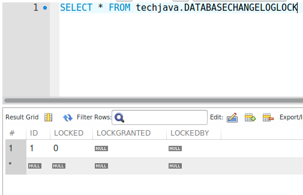
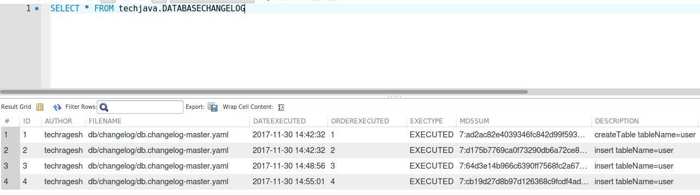

# springboot-liquibase-demo
This project shows how to create tables and insert records through code using liquibase without add manually by DML or DDL Script.

# Liquibase #

Liquibase is an open source database change management tool built on Java.  Rather than writing SQL directly against the database to create, update or drop database objects, developers define their desired database changes in XML files.  The XML file, called a changelog, contains a list of changesets that define a desired database change in an database agnostic abstraction.  The changelog is intended to contain an evolving list of database changes the team would like to apply to a target database.  This list is additive over time.  Here is a simple example:
```
<databaseChangeLog>
   <changelog id="FOO-196-01" author="Mike McGarr" >
      <createTable tableName="users">
         <column name="id" type="int">
            <constraints primaryKey="true" nullable="false"/>
         </column>
         <column name="name" type="varchar(100)">
            <constraints nullable="false"/>
         </column>
      </createTable>
   </changelog>
</databaseChangeLog>
```
Liquibase can be executed through either the command line or as part of a build using Ant, Maven or the like (I would recommend build integration).  Liquibase will apply the changesets directly to the database and can handle rollbacks and tagging of database state.

# How does it work #
When Liquibase is executed, you must specify the database against which to apply your changesets.  Liquibase uses two tables to manage changes to the database: databasechangelog and databasechangelock.  If the tables don’t exist on the target database, they are created.  An entry is added to the databasechangelock table which ensures only one instance of Liquibase is running at a time.  The databasechangelog table contains a listing of every changeset that has been applied to this database.  Liquibase conducts a diff of the table contents with the XML files and determines which changes still need to be applied.  Once this is determined, Liquibase will then apply the changes to the database.  If you are new to Liquibase, then I recommend checking out their documentation on how to setup and get started.

# Keypoints to Remember #

* Exclude LiquibaseAutoConfiguration.class in Springboot Main class.
* Create Datasource to get Connection with the help of Liquibase database.
* Add yaml file in the Liquibase class and update the contexts.

# Screenshot of this application Ouptut # 






# Happy Coding #
